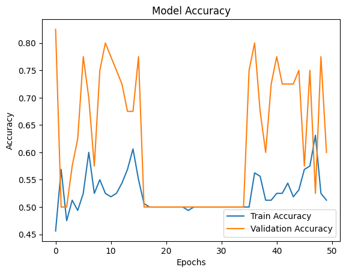
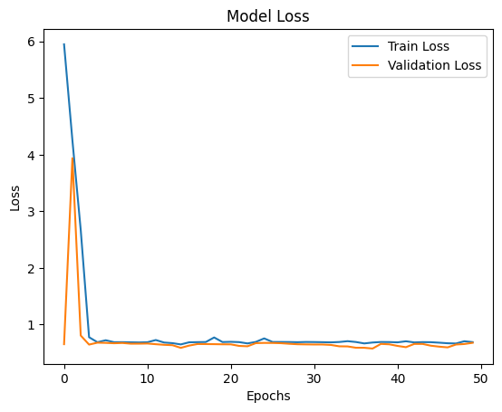

## **Project Report: Maize Disease Classification Using Transfer Learning and Custom CNN**

### **1. Introduction**
The project aims to classify two maize diseases, **Army Worm** and **Cutworm**, based on image data. This is crucial for early detection and mitigation of crop damage caused by these diseases. Two approaches were implemented:

1. **Transfer Learning**: Using a pre-trained ResNet50 model.
2. **Custom Convolutional Neural Network (CNN)**: A model designed from scratch.

The goal was to compare the accuracy, efficiency, and generalization ability of these approaches.

---

### **2. Methodology**

#### **2.1 Data Preparation**
- **Dataset**:
  - Total Images: 200 (160 for training and 40 for validation).
  - Two classes: Army Worm (100 images) and Cutworm (100 images).

- **Data Augmentation**:
  - Techniques applied: Rescaling, Rotation, Zooming, Flipping, and Shifting.
  - Purpose: To prevent overfitting and increase generalization.

#### **2.2 Model Architectures**
1. **Transfer Learning**:
   - **Base Model**: ResNet50 (pre-trained on ImageNet).
   - **Custom Layers**: Added Dense and Dropout layers for classification.
   - **Parameters**: Frozen the base layers, only fine-tuned the top layers.

2. **Custom CNN**:
   - **Architecture**:
     - 3 Convolutional Layers with ReLU activation and MaxPooling.
     - Fully Connected Dense layers.
     - Dropout for regularization.
   - Designed for a lightweight implementation.

#### **2.3 Training Setup**
- **Optimizer**: Adam.
- **Loss Function**: Categorical Crossentropy.
- **Metrics**: Accuracy.
- **Batch Size**: 16.
- **Epochs**: 25.

#### **2.4 Tools and Libraries**
- TensorFlow, Keras, Matplotlib, NumPy, Pandas, scikit-learn.

---

### **3. Results**

#### **3.1 Training Performance**
| **Model**              | **Training Accuracy** | **Validation Accuracy** | **Training Time** |
|-------------------------|-----------------------|--------------------------|--------------------|
| Transfer Learning (ResNet50) | 54.53%                | 60%                      | ~59 minutes        |
| Custom CNN              | 86.53%                | 77.50%                   | ~6 minutes         |

#### **3.2 Observations**
1. **Transfer Learning**:
   - Achieved moderate accuracy with some limitations in generalization.
   - Training time was significantly longer compared to the Custom CNN.

2. **Custom CNN**:
   - Achieved higher accuracy than ResNet50 within fewer epochs.
   - Faster training and demonstrated better efficiency for lightweight implementation.

#### **3.3 Overfitting/Underfitting**
- Both models showed slight overfitting, mitigated by augmentation and Dropout.

---

### **4. Visualizations for ResNet50**

1. **Training vs. Validation Accuracy**:

   

2. **Training vs. Validation Loss**:

   

### **4. Visualizations for Custom CNN**

1. **Training vs. Validation Accuracy**:

   

2. **Training vs. Validation Loss**:

   

---

### **5. Conclusion**

1. **Findings**:
   - Both models demonstrated similar performance on this dataset.
   - Transfer Learning with ResNet50 showed moderate results, but training time was longer.
   - Custom CNN achieved higher accuracy and faster training, indicating its suitability for this task.

2. **Future Work**:
   - Expand the dataset to include more images and other maize diseases.
   - Experiment with state-of-the-art models like EfficientNet or Vision Transformers.
   - Utilize advanced augmentation techniques like CutMix or MixUp.
   - Incorporate model ensemble techniques to boost accuracy.

3. **Applications**:
   - Early disease detection in maize cultivation.
   - Deployment on edge devices for real-time disease monitoring.

---

python train.py --train-dir Dataset/train --validation-dir Dataset/validation --model-type resnet50 --epochs 20 --learning-rate 0.0001 --batch-size 32 --target-size 256 256

python train.py --train-dir Dataset/train --validation-dir Dataset/validation --model-type resnet50 --epochs 10 --model-save-path ./models/trained_model.h5  --learning-rate 0.0001 --batch-size 32 --target-size 256 256 --verbose 1

